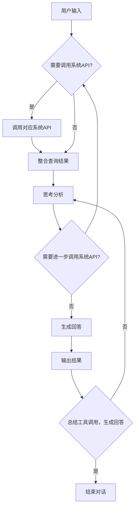
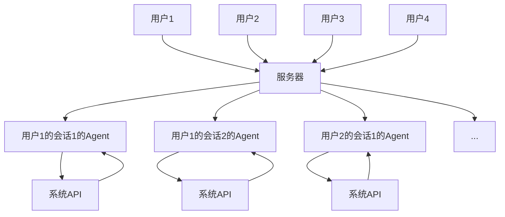

# 🤖Chat With CUHKSZ

## 🔧快速开始

1. 💻 桌面版前端下载

支持 Windows 和 Linux 平台：

[📦 Releases](https://github.com/BetterAndBetterII/Chat-With-CUHKSZ/releases/latest)

针对linux平台，需要安装fuse：`sudo apt install libfuse2`

（ubuntu24.04有一定不兼容fuse，参考 [Ubuntu 24.04安装fuse后重启无法进入桌面](https://liar.org.cn/Linux/3.html) ）

2. 🚀 后端快速启动：

```bash
docker pull ghcr.io/betterandbetterii/chat-with-cuhksz:latest
docker run -d --name chat-with-cuhksz-backend -p 8080:8080 ghcr.io/betterandbetterii/chat-with-cuhksz:latest -e APIBASE=https://api.nextapi.fun/v1/chat/completions -e APIKEY=YOUR_API_KEY
```

或使用docker-compose快速启动（需要配置APIKEY）：

```bash
docker-compose up -d --build
```

## 📝 使用方法

1. 进入程序后输入账号与密码登录

2. 登录后即可开始使用

## 🎯 功能介绍

本项目实现了一个全面接入大学各类校内服务系统的聊天机器人

### 🔌 已接入系统

1. 📚 SIS系统
  - 查询课表
  - 查询成绩
  - 查询课程
2. 📖 图书馆系统
  - 查询文章
  - 查询期刊
  - 查询书籍
  - 全域查询
3. 📧 邮件系统
  - 自动编辑发送邮件
4. 📋 BlackBoard系统
  - 查询公告
  - 查询作业
  - 查询作业评分
  - 查询修读课程
5. 🏢 场地预定系统
  - 查询场地
  - 预定场地

### 🧠 自主多轮思考智能体Agent



Agent在处理用户请求时会：
1. 🔍 解析用户输入，理解用户意图
2. 🤔 判断是否需要查询校内系统获取信息
3. 📊 对获取的信息进行分析和整合
4. 🔄 通过多轮思考+工具调用完成目标
5. ❓ 如果发现信息不足，会自动调用系统API获取更多信息，或请求用户补充信息，或请求用户二次确认（关键操作，如预定场地）
6. ✅ 根据工具调用情况总结，生成回答

## 🏗️ Server-Client架构

支持单服务器，服务多用户。

服务器对每个用户的每个会话，都会创建一个独立的Agent，以确保用户隐私和会话独立性。

服务器会自动管理聊天记录，实现多端同步，多端登录。不同用户的聊天记录相互独立。



## 👨‍💻 开发指南

### 📁 选择正确的 CMakeLists.txt

- 前端 `CMakeLists.txt` 位于 `frontend` 目录下
- 后端 `CMakeLists.txt` 位于 `backend` 目录下

### 🧪 当你需要测试某个模块时

比如我今天写好了 BlackBoardSystem， 我希望测试一下它的功能是否正常，那么我需要在 `backend` 目录下的 `test` 目录新建一个 `test_blackboard` 文件，然后在 `CMakeLists.txt` 文件中修改如下：

```cmake
add_executable(backend_executable ./test/test_blackboard.cpp   // 这里的test_blackboard.cpp是你新建的测试文件
        ${BACKEND_SOURCES})
```

也就是将你的测试文件加入到 `add_executable` 中，然后重新编译即可。

### 📦 当你需要添加新的模块时

你需要将你的模块放在 `backend` 目录下的 `src` 目录中，头文件放在 `include` 目录中，然后在 `CMakeLists.txt` 文件不需要修改，因为它会自动扫描 `src` 目录下的所有文件。

**注意：** 如果你的模块需要依赖其他模块，请在 `CMakeLists.txt` 文件中添加依赖。

### ⚙️ 当你需要添加新的依赖时

你需要在 `CMakeLists.txt` 文件中添加依赖，比如我今天需要添加一个新的依赖 `libcurl`，那么我需要在 `CMakeLists.txt` 文件中添加如下代码：

```cmake
find_package(CURL REQUIRED)
target_link_libraries(backend_executable CURL::libcurl)
```
